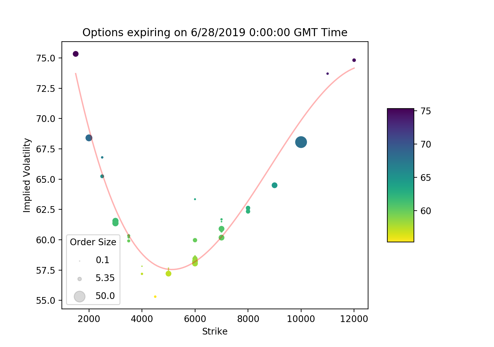
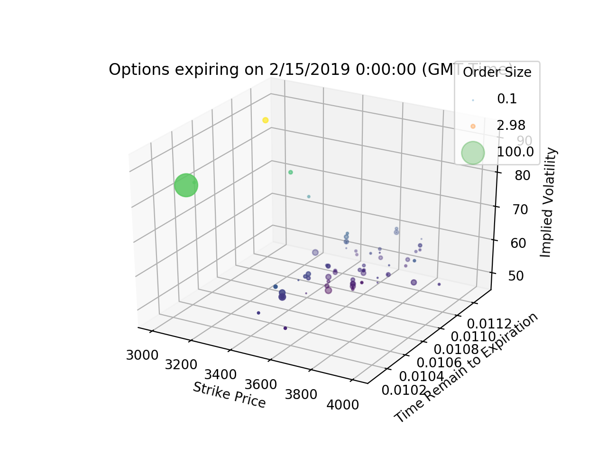
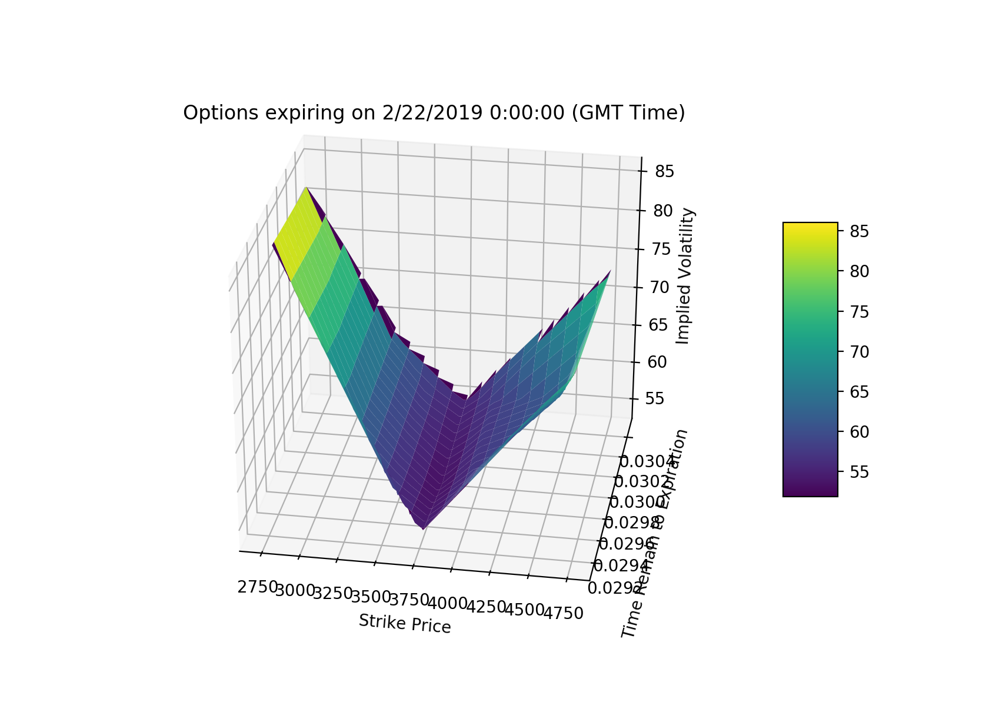

# Deribit Volatility Visualization Tool
A visualization tool created to help gauge the volatility of Deribit options

This tool can connect to Deribit's public endpoint (registration required) and get real-time analysis.

**Note:**
This project seems to be getting a lot attention. 
I will try to update this project in the next 2 weeks.

## Installing
```bash
git clone https://github.com/pengjin2/Derbit-Volatility-Visulization.git
```

## Traceback
Data to be included in the plot and data stream.

## Save data to local

Data can be saved to local directory. When you set `save_local` = `True`, the data used to draw the session graphs will be updated automatically.

## Plot Types
Currently only 3 kinds of plots are supported. More will be provided if deem necessary.

### ScatterPlot with polynomial fitted line


### ScatterPlot in 3D dimension


### Volatility Surface Plot


## Author
[Peng Jin](https://www.linkedin.com/in/peng-jin-24a23b117/)

## License
This project is licensed under the MIT License - see the [LICENSE](LICENSE) file for details
